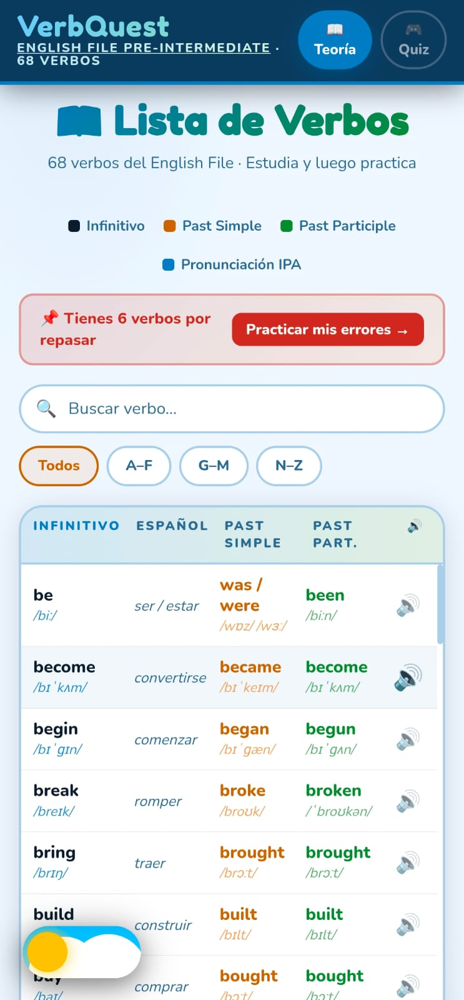
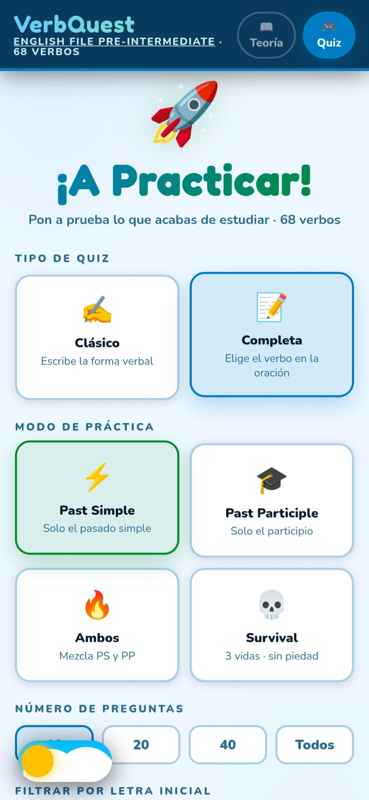
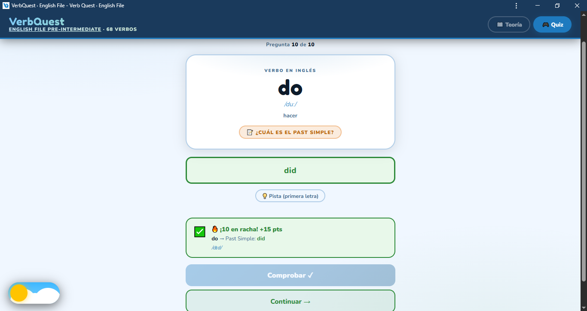
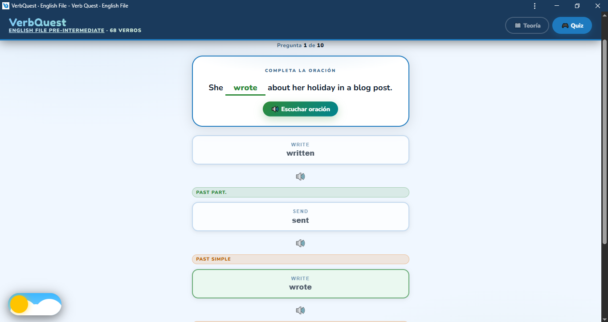
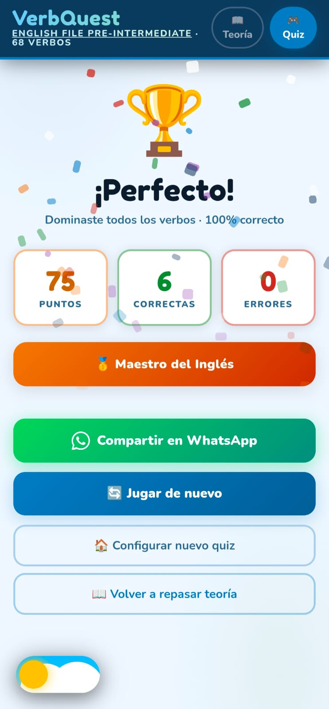
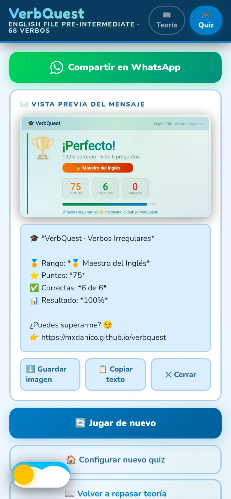

<div align="center">

# 🎓 VerbQuest

**Aprende y practica los verbos irregulares del inglés de forma interactiva**

[](https://mxdanico.github.io/verbquest/)
[](https://mxdanico.github.io/verbquest/)
[](https://mxdanico.github.io/verbquest/)
[](./LICENSE)

</div>

---

## 📖 Descripción

**VerbQuest** es una aplicación web progresiva (PWA) diseñada para practicar **94 verbos irregulares del inglés** de forma gamificada, rápida y efectiva.

Incluye lista de verbos con pronunciación IPA, quizzes interactivos con múltiples modos, sistema de puntos y rachas, y funciona **sin conexión a Internet** desde cualquier dispositivo — incluyendo las tipografías, que también se cachean offline.

---

## 🖼️ Capturas de pantalla

<div align="center">

### 📚 Lista de Verbos — Teoría


> Lista completa con infinitivo, Past Simple, Past Participle y pronunciación IPA en español.

---

### ⚙️ Configuración del Quiz


> Elige el tipo de quiz, modo de práctica, número de preguntas y filtra por letra inicial.

---

### 🎮 Quiz — Modo Clásico


> Escribe la forma verbal correcta. Sistema de rachas con bonificación de puntos.

---

### 🔤 Quiz — Modo Completa la Oración


> Identifica el verbo correcto en el contexto de una oración real.

---

### 🏆 Pantalla de Resultados


> Resumen con puntos, aciertos, errores y rango obtenido.

---

### 📤 Compartir Resultado


> Comparte tu puntuación en WhatsApp con vista previa del resultado.

</div>

---

## ✨ Características

| Funcionalidad | Descripción |
|---|---|
| 📖 **Lista de verbos** | 94 verbos irregulares con traducción y pronunciación IPA |
| 🔍 **Búsqueda** | Filtra por verbo, traducción o forma verbal |
| ✍️ **Quiz Clásico** | Escribe la forma verbal correcta |
| 📝 **Quiz Completa** | Elige el verbo correcto en una oración |
| ⚡ **Past Simple** | Modo exclusivo de pasado simple |
| 🎓 **Past Participle** | Modo exclusivo de participio pasado |
| 🔥 **Modo Combinado** | Mezcla Past Simple + Past Participle de forma aleatoria |
| 💀 **Modo Survival** | 3 vidas, sin piedad |
| 🔥 **Rachas** | Sistema de bonificaciones por respuestas consecutivas |
| 💡 **Pistas** | Primera letra disponible con penalización de puntos |
| 🌙 **Tema** | Modo claro y oscuro |
| 🔊 **Sonido** | Efectos de audio generados en tiempo real (Web Audio API) |
| 📱 **PWA** | Instalable como app nativa en móvil y escritorio |
| ✈️ **Offline** | Funciona sin conexión a Internet (fuentes incluidas) |
| 📤 **Compartir** | Comparte tus resultados por WhatsApp |
| 🔗 **Preview de enlace** | Vista previa en WhatsApp, Telegram, Discord, Twitter/X y redes sociales |

---

## 📱 Instalación como App

### Android (Chrome)
1. Abrir [VerbQuest](https://mxdanico.github.io/verbquest/) en Chrome
2. Pulsar el menú **⋮** (tres puntos)
3. Seleccionar **Agregar a pantalla de inicio**

### iPhone / iPad (Safari)
1. Abrir [VerbQuest](https://mxdanico.github.io/verbquest/) en Safari
2. Pulsar el botón **Compartir** (cuadro con flecha hacia arriba)
3. Seleccionar **Agregar a pantalla de inicio**

---

## 📂 Estructura del proyecto

```text
verbquest/
│
├── index.html
├── manifest.json
├── sw.js
├── README.md
│
├── assets/
│   ├── css/
│   │   └── style.css
│   ├── js/
│   │   └── script.js
│   └── icons/
│       ├── favicon.png
│       ├── icon-192.png
│       └── icon-512.png
│
└── docs/
    └── screenshots/
        ├── lista-verbos.jpeg
        ├── configuracion-quiz.jpeg
        ├── quiz-clasico.png
        ├── quiz-completa.png
        ├── resultados.jpeg
        └── compartir.jpeg
```

---

## 🛠️ Tecnologías


- **HTML5** — Estructura semántica
- **CSS3** — Estilos, animaciones y modo oscuro
- **JavaScript (Vanilla JS)** — Lógica de la aplicación sin frameworks
- **Web Audio API** — Efectos de sonido generados en tiempo real
- **Web Speech API** — Pronunciación TTS de los verbos
- **Service Worker + Cache API** — Soporte offline completo (assets + fuentes)
- **Canvas API** — Generación de imagen de resultados para compartir
- **Open Graph + Twitter Card** — Preview de enlace en redes sociales y mensajería
- **GitHub Pages** — Despliegue gratuito y continuo

---

## 🚀 Despliegue

El proyecto está publicado mediante **GitHub Pages** directamente desde la rama `main`.

🔗 **URL pública:** [https://mxdanico.github.io/verbquest/](https://mxdanico.github.io/verbquest/)

---

## 🔗 Preview al compartir el enlace

Al compartir la URL del proyecto en cualquier plataforma se muestra una vista previa automática con título, descripción e imagen:

| Plataforma | Soporte |
|---|---|
| WhatsApp | ✅ Preview completo |
| Telegram | ✅ Preview completo |
| Discord | ✅ Embed con imagen |
| Twitter / X | ✅ Summary card |
| Facebook / LinkedIn | ✅ Open Graph |
| iMessage | ✅ Vista previa |

Esto se logra mediante etiquetas **Open Graph** y **Twitter Card** en el `<head>` del HTML, usando el ícono de 512×512 px como imagen de previsualización.

---

## 📚 Verbos incluidos (94)

<details>
<summary>Ver lista completa</summary>

| Infinitivo | Past Simple | Past Participle | Español |
|---|---|---|---|
| be | was / were | been | ser / estar |
| become | became | become | convertirse |
| begin | began | begun | comenzar |
| break | broke | broken | romper |
| bring | brought | brought | traer |
| build | built | built | construir |
| buy | bought | bought | comprar |
| can | could | – | poder |
| catch | caught | caught | atrapar / coger |
| choose | chose | chosen | elegir |
| come | came | come | venir |
| cost | cost | cost | costar |
| cut | cut | cut | cortar |
| do | did | done | hacer |
| dream | dreamt | dreamt | soñar |
| drink | drank | drunk | beber |
| drive | drove | driven | conducir / manejar |
| eat | ate | eaten | comer |
| fall | fell | fallen | caer |
| feel | felt | felt | sentir |
| find | found | found | encontrar |
| fly | flew | flown | volar |
| forget | forgot | forgotten | olvidar |
| get | got | got | conseguir / obtener |
| give | gave | given | dar |
| go | went | gone | ir |
| grow | grew | grown | crecer |
| have | had | had | tener |
| hear | heard | heard | oír / escuchar |
| hit | hit | hit | golpear |
| hold | held | held | sostener / aguantar |
| keep | kept | kept | mantener / guardar |
| know | knew | known | saber / conocer |
| lay | laid | laid | poner / tender |
| learn | learnt | learnt | aprender |
| leave | left | left | dejar / salir |
| lend | lent | lent | prestar |
| let | let | let | dejar / permitir |
| lose | lost | lost | perder |
| make | made | made | hacer / fabricar |
| meet | met | met | conocer / reunirse |
| pay | paid | paid | pagar |
| put | put | put | poner / colocar |
| read | read | read | leer |
| ring | rang | rung | llamar / sonar |
| run | ran | run | correr |
| say | said | said | decir |
| see | saw | seen | ver |
| sell | sold | sold | vender |
| send | sent | sent | enviar / mandar |
| set | set | set | fijar / establecer |
| sew | sewed | sewn | coser |
| shake | shook | shaken | sacudir / agitar |
| shine | shone | shone | brillar |
| shoot | shot | shot | disparar |
| show | showed | shown | mostrar |
| shrink | shrank | shrunk | encoger |
| shut | shut | shut | cerrar |
| sing | sang | sung | cantar |
| sink | sank | sunk | hundir / hundirse |
| sit | sat | sat | sentarse |
| sleep | slept | slept | dormir |
| slide | slid | slid | deslizar |
| sow | sowed | sown | sembrar |
| speak | spoke | spoken | hablar |
| spell | spelt | spelt | deletrear |
| spend | spent | spent | gastar / pasar tiempo |
| spill | spilt | spilt | derramar |
| split | split | split | partir / dividir |
| spoil | spoilt | spoilt | estropear / mimar |
| spread | spread | spread | extender / difundir |
| stand | stood | stood | estar de pie |
| steal | stole | stolen | robar |
| sting | stung | stung | picar / aguijonear |
| stink | stank | stunk | apestar |
| strike | struck | struck | golpear / impactar |
| swear | swore | sworn | jurar / maldecir |
| sweep | swept | swept | barrer |
| swim | swam | swum | nadar |
| take | took | taken | tomar / llevar |
| teach | taught | taught | enseñar |
| tear | tore | torn | romper / rasgar |
| tell | told | told | decir / contar |
| think | thought | thought | pensar |
| throw | threw | thrown | lanzar / tirar |
| tread | trod | trodden | pisar |
| understand | understood | understood | entender |
| wake | woke | woken | despertar |
| wear | wore | worn | llevar puesto / vestir |
| weave | wove | woven | tejer |
| weep | wept | wept | llorar |
| win | won | won | ganar |
| wring | wrung | wrung | retorcer / escurrir |
| write | wrote | written | escribir |

</details>

---

## 🐛 Correcciones y mejoras (v2.0)

| Cambio | Estado |
|---|---|
| Verbo `hold` faltante en la base de datos (causaba error en quiz) | ✅ Corregido |
| Modo "Ambos" alternaba PS/PP de forma predecible (par/impar) | ✅ Ahora es aleatorio |
| Distractores en quiz podían coincidir con la respuesta correcta | ✅ Corregido |
| `document.execCommand('copy')` deprecado en portapapeles | ✅ Reemplazado por Clipboard API con fallback seguro |
| `purpose: "any maskable"` combinado en manifest.json | ✅ Separado en entradas independientes |
| URL del autor hardcodeada en canvas y WhatsApp | ✅ Centralizada en constante `APP_URL` |
| Fuentes Google no cacheadas para modo offline | ✅ Service Worker las cachea en la instalación |
| Sin preview al compartir el enlace en redes sociales | ✅ Open Graph + Twitter Card implementados |
| Base de verbos ampliada de 69 a 94 verbos | ✅ 25 verbos nuevos con IPA completo |
| Botón "Todos" hardcodeado a 68 | ✅ Dinámico según el pool disponible |

---

## 📚 Fuente de contenido

Los verbos corresponden al libro **English File Pre-Intermediate** de Oxford University Press y se utilizan exclusivamente con fines educativos y de práctica personal.

---

## 📄 Licencia

Proyecto educativo y de práctica personal. Todos los derechos reservados.

© 2026 [mxdanico](https://github.com/mxdanico)
